<p align="center">
  
  
  
  
  
  
  
  
</p>

<h1 align="center">Lawyer Management System</h1>

<p align="center">
  A production-grade, microservice-based appointment and case management platform built with <strong>NestJS</strong>, <strong>RabbitMQ</strong>, and <strong>MongoDB</strong>.
</p>

<p align="center">
  <strong>Version:</strong> 0.0.1 &nbsp;|&nbsp; <strong>Node:</strong> >=22 &nbsp;|&nbsp; <strong>Package Manager:</strong> npm
</p>

<hr />

## Table of Contents

- [Project Overview](#project-overview)
- [Business Features](#business-features)
- [System Architecture](#system-architecture)
- [Technology Stack](#technology-stack)
- [Monorepo Structure](#monorepo-structure)
- [Microservices](#microservices)
  - [API Gateway](#-api-gateway)
  - [Auth Service](#-auth-service)
  - [Booking Service](#-booking-service)
  - [Provider Service](#-provider-service)
  - [Payment Service](#-payment-service)
  - [Notification Service](#-notification-service)
- [Shared Libraries](#shared-libraries)
- [Messaging Architecture](#messaging-architecture)
- [Service Communication Matrix](#service-communication-matrix)
- [Endpoint Documentation](#endpoint-documentation)
- [Environment Variables](#environment-variables)
- [Running the Project](#running-the-project)
- [Docker (Future)](#docker-future)
- [Security](#security)
- [Performance](#performance)
- [Future Roadmap](#future-roadmap)
- [Development Guidelines](#development-guidelines)
- [Architecture Decisions](#architecture-decisions)
- [Best Practices](#best-practices)

---

## Project Overview

### Problem

Law firms and legal clinics struggle to manage appointments, client communications, payments, and provider scheduling across disparate tools. The **Lawyer Management System** solves this with a unified, event-driven platform where every domain — auth, booking, payments, notifications, provider management — operates as an independent, scalable microservice.

### Who Uses It

- **Clients / Patients** — browse providers, book appointments, pay, receive notifications
- **Legal Providers** — manage schedules, accept bookings, update availability, receive payouts
- **Administrators** — manage users, verify provider credentials, oversee payments and system health

### Why Microservices

- **Independent deployability** — each service can be updated, scaled, and deployed without affecting others
- **Domain isolation** — bounded contexts prevent accidental coupling and keep codebases focused
- **Async resilience** — RabbitMQ decouples services; a notification or payment failure never blocks a booking
- **Technology flexibility** — each service could use different storage or versions without global impact
- **Team scalability** — multiple teams can own separate services with clear API contracts (RMQ patterns)

### High-Level Workflow

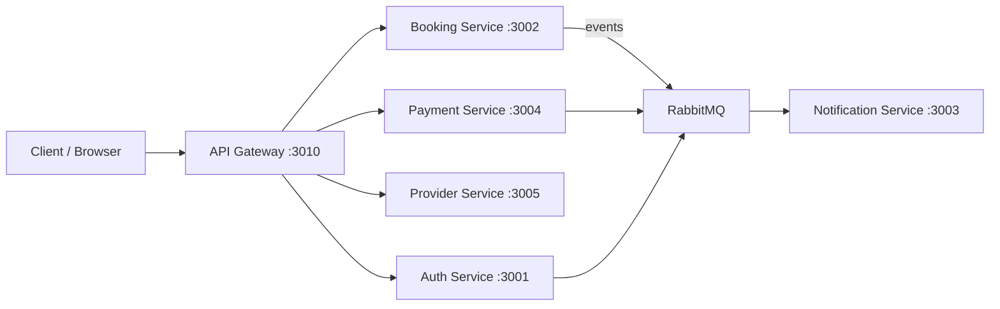

---

## Business Features

### Authentication & User Management

**Business:** Clients and providers register, log in, verify their email, reset passwords, and maintain profiles. Administrators manage all users.

**Technical:** JWT-based authentication with access/refresh token rotation, cookie-parser for token storage, and bcrypt password hashing. Role-based access control (RBAC) with `Role.ADMIN`, `Role.PROVIDER`, and `Role.PATIENT` enums.

### Provider Management

**Business:** Legal professionals create detailed profiles with specializations, credentials, languages, and location. Administrators verify uploaded credentials. Clients search and filter providers by specialization, rating, language, and city.

**Technical:** Full CRUD on provider profiles with embedded credential sub-documents. Admin-only verification workflow. MongoDB text indexes on name, bio, and specializations for search. Rating auto-computed from reviews.

### Appointment Booking

**Business:** Clients browse provider availability, book appointments with optional hold mechanism, cancel or reschedule, and track appointment history. Providers manage their weekly schedules, set slot durations, buffer times, and blocked dates.

**Technical:** Schedule-driven slot generation. Time-slot holds with expiry. Multi-step booking flow: availability check → hold → payment → confirmation. Appointment lifecycle: `pending` → `confirmed` → `checked_in` → `in_progress` → `completed` / `cancelled`.

### Notifications

**Business:** Clients and providers receive email and SMS notifications for booking confirmations, cancellations, reminders (24h and 1h before), and welcome messages.

**Technical:** Nodemailer for transactional emails (HTML templates) and Twilio for SMS. All notifications are event-driven via RabbitMQ — the notification service is a pure event consumer with zero HTTP endpoints.

### Payments

**Business:** Secure online payments via credit/debit card at booking time. Webhook-based lifecycle to keep booking and payment state synchronized.

**Technical:** Stripe Checkout Sessions for payment collection. Stripe webhook (`payment.intent.succeeded`) at `POST /api/v1/payment/webhook` updates appointment status and emits `payment.succeeded` to the booking service via RMQ.

### Reviews & Ratings

**Business:** After a completed appointment, clients rate providers (1–5 stars) and leave feedback. Provider ratings are auto-computed and displayed during search.

**Technical:** One review per appointment enforced via unique `appointmentId`. Provider `averageRating` and `totalReviews` computed on every review submission.

### Provider Search

**Business:** Find providers by specialization, minimum rating, city, language, and verification status. Results sortable by rating, review count, or creation date.

**Technical:** Query-based search with MongoDB filters and text indexes on `fullName`, `bio`, and `specializations`. Paginated results with `page` and `limit` parameters.

---

## System Architecture

### High-Level Overview

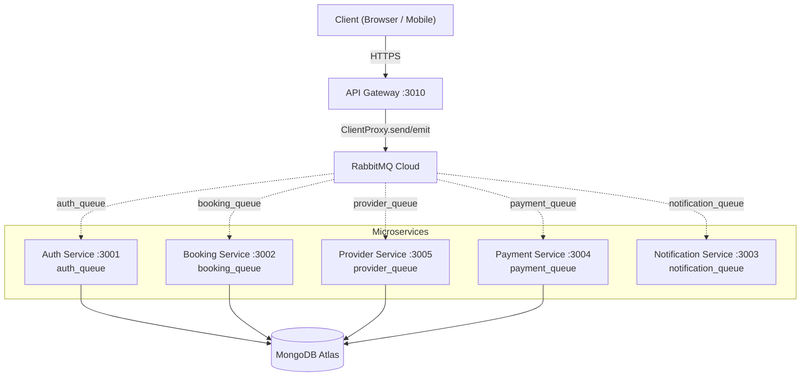

### Request Flow

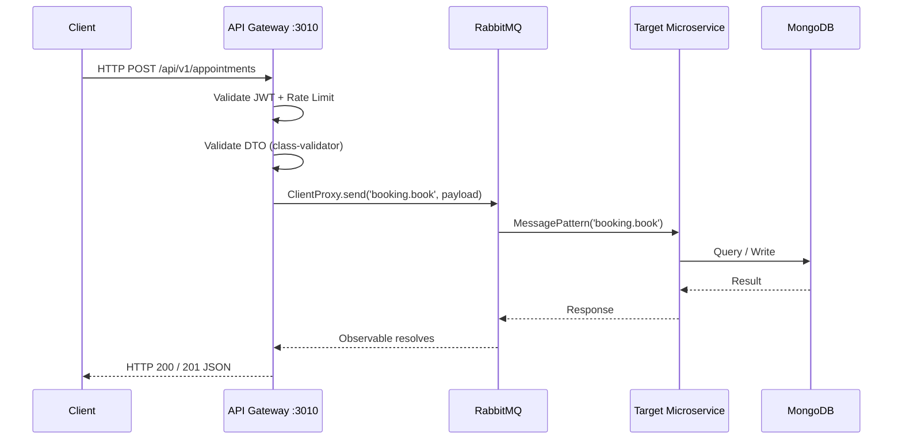

### Event Flow (Fire-and-Forget)

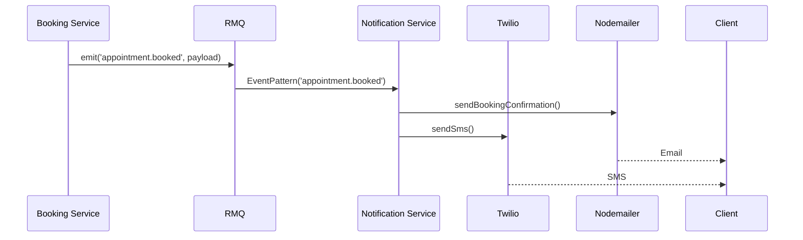

### Payment Flow

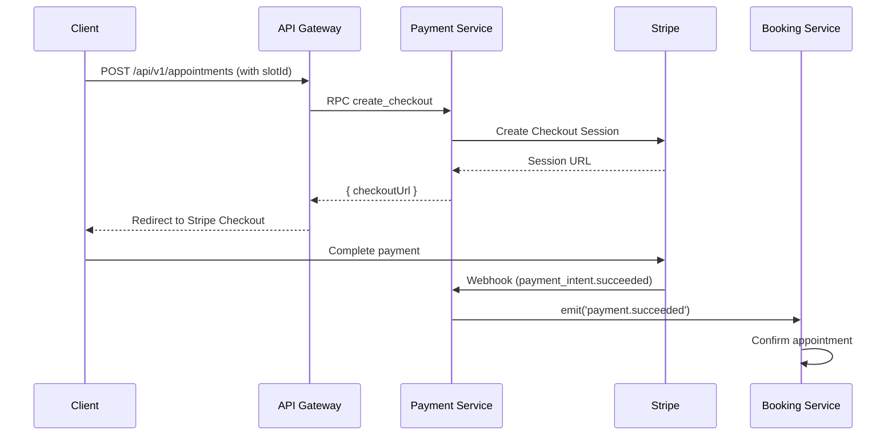

### Component Diagram

```mermaid
graph TB
    subgraph "API Gateway :3010"
        AuthCtrl["AuthController"]
        BookingCtrl["BookingController"]
        ProviderCtrl["ProviderController"]
        AdminProvCtrl["AdminProviderController"]
        Throttle["ThrottlerGuard (4 req/min)"]
        Swagger["Swagger UI /api"]
    end

    subgraph "Common Lib (@app/common)"
        Guards["AuthGuard RolesGuard"]
        Filters["CatchExceptionsFilter<br/>CatchGatewayExceptionsFilter"]
        Pipes["ValidateObjectIdPipe"]
        Enums["Role enum patterns"]
        JwtStrat["JwtStrategyService"]
    end

    subgraph "RMQ Lib (@app/rmq)"
        RmqSvc["RmqService"]
        RmqMod["RmqModule"]
    end

    subgraph "Auth Service :3001"
        AuthHTTP["AuthController (HTTP)"]
        AdminCtrl["AdminController (HTTP)"]
        ProfileCtrl["ProfileController (HTTP)"]
        AuthRPC["AuthRpcController (RMQ)"]
    end

    subgraph "Booking Service :3002"
        AvailCtrl["AvailabilityController (HTTP)"]
        ApptCtrl["AppointmentController (HTTP)"]
        SchedCtrl["ScheduleController (HTTP)"]
        BookingRPC["BookingRpcController (RMQ)"]
    end

    subgraph "Provider Service :3005"
        ProvCtrl["ProfileController (HTTP)"]
        RevCtrl["ReviewController (HTTP)"]
        ProvAdminCtrl["AdminController (HTTP)"]
        ProvRPC["ProviderRpcController (RMQ)"]
    end

    subgraph "Payment Service :3004"
        PayCtrl["PaymentController (HTTP)"]
        PayRPC["PaymentRpcController (RMQ)"]
    end

    subgraph "Notification Service :3003"
        NotifyCtrl["NotificationController (RMQ only)"]
    end

    AuthCtrl --> AuthRPC
    BookingCtrl --> BookingRPC
    ProviderCtrl --> ProvRPC
    AdminProvCtrl --> ProvRPC
    PayCtrl --> PayRPC
```

---

## Technology Stack

| Technology | Version | Purpose | Rationale |
|---|---|---|---|
| **NestJS** | 11 | Application framework | Modular architecture, decorator-based controllers, first-class monorepo and microservice support |
| **TypeScript** | 5.7 | Language | Type safety, enhanced IDE support, catch errors at compile time |
| **MongoDB** | 9.2 (via Mongoose 11) | Database | Schema-flexible document store, excellent for profile/schedule/appointment documents with embedded sub-schemas |
| **RabbitMQ** | 3.x (CloudAMQP) | Message broker | Reliable, durable message delivery; native NestJS microservice transport; supports both RPC and pub/sub patterns |
| **JWT / Passport** | — | Authentication | Stateless auth across microservices; `passport-jwt` strategy validates tokens without session store |
| **Stripe** | 22 | Payment processing | Industry-standard, webhook-based lifecycle, Checkout Sessions reduce PCI scope |
| **Nodemailer** | 8 | Email delivery | SMTP-based transactional emails (Gmail); HTML templates for branded messaging |
| **Twilio** | 6 | SMS delivery | Programmable SMS for appointment reminders and confirmations |
| **Swagger** | 11 | API documentation | Auto-generated OpenAPI spec at `GET /api` on the gateway |
| **class-validator / class-transformer** | 0.14 / 0.5 | Input validation | Decorator-based DTO validation with automatic transformation |
| **@nestjs/throttler** | 6 | Rate limiting | Global rate limiter: 4 requests/minute per client |
| **@nestjs/schedule** | 6 | Cron jobs | Appointment reminder scheduling (24h and 1h before) |
| **Jest** | 30 | Testing | Unit and integration tests co-located with source files |
| **ESLint / Prettier** | 9 / 3 | Code quality | Consistent code style via `singleQuote`, `trailingComma: "all"` |
| **Concurrently** | 9 | Dev tooling | Run all 6 services in parallel with a single command |

---

## Monorepo Structure

```
booking_system/
├── .env                          # Environment variables (live secrets — do NOT commit)
├── .gitignore
├── .prettierrc                   # singleQuote: true, trailingComma: "all"
├── AGENTS.md                     # AI agent instruction file
├── PLAN.md                       # Multi-phase implementation roadmap
├── README.md                     # This file
├── nest-cli.json                 # NestJS monorepo configuration
├── package.json                  # Workspace root
├── tsconfig.json                 # TypeScript configuration with @app path aliases
├── tsconfig.build.json           # Build-specific TS config
├── eslint.config.mjs             # ESLint flat config (9.x)
├── qodana.yaml                   # JetBrains Qodana CI linter config
│
├── apps/
│   ├── api-gateway/              # HTTP entry point (port 3010)
│   │   └── src/
│   │       ├── main.ts
│   │       ├── api-gateway.module.ts
│   │       ├── auth/             # Auth controller + service
│   │       ├── booking/          # Booking controller + service
│   │       ├── provider/         # Provider + admin provider controllers
│   │       ├── decorators/       # Custom decorators
│   │       ├── dots/             # Gateway-specific DTOs
│   │       └── insterceptors/    # Interceptors
│   │
│   ├── auth_service/             # Authentication & user CRUD (port 3001)
│   │   └── src/
│   │       ├── main.ts
│   │       ├── app.module.ts
│   │       ├── auth/             # Auth controller + service
│   │       ├── user/             # User controllers (admin, profile), DTOs, schemas
│   │       ├── nodemailer/       # Mailer module
│   │       ├── rpcController/    # RMQ message handlers
│   │       └── shared-rmq.module.ts
│   │
│   ├── booking_service/          # Appointment & schedule management (port 3002)
│   │   └── src/
│   │       ├── main.ts
│   │       ├── booking_service.module.ts
│   │       ├── booking_service.controller.ts  # HTTP controllers
│   │       ├── booking_service.service.ts
│   │       ├── appointment/      # Appointment module
│   │       ├── dtos/             # Booking DTOs
│   │       ├── models/           # Mongoose schemas
│   │       ├── rpcController/    # RMQ message handlers
│   │       └── services/         # Business logic services
│   │
│   ├── notification_service/     # Email & SMS (port 3003, RMQ only)
│   │   └── src/
│   │       ├── main.ts
│   │       ├── notification_service.module.ts
│   │       ├── notification_service.controller.ts  # RMQ event handlers
│   │       ├── notification_service.service.ts
│   │       └── nodemailer/       # Mailer service
│   │
│   ├── payment_service/          # Stripe payments (port 3004)
│   │   └── src/
│   │       ├── main.ts
│   │       ├── payment_service.module.ts
│   │       ├── payment_service.controller.ts # Webhook + RMQ handlers
│   │       ├── payment_service.service.ts
│   │       ├── payment.schema.ts
│   │       └── types.ts
│   │
│   └── provider_service/         # Provider profiles & reviews (port 3005)
│       └── src/
│           ├── main.ts
│           ├── provider_service.module.ts
│           ├── controllers/      # Profile, Review, Admin controllers
│           ├── dtos/             # Profile, Review, Search DTOs
│           ├── models/           # Mongoose schemas
│           ├── rpc/              # RMQ message handlers
│           └── services/         # Business logic
│
├── libs/
│   ├── common/                   # Shared library: auth, guards, pipes, filters, DTOs
│   │   └── src/
│   │       ├── index.ts
│   │       ├── common.module.ts
│   │       ├── constants/        # RMQ patterns, enums
│   │       ├── global/           # DTOs, pipes, filters, services
│   │       └── auth/             # Guards, strategies, decorators, enums
│   │
│   └── rmq/                      # Shared library: RabbitMQ utilities
│       └── src/
│           ├── index.ts
│           ├── rmq.module.ts
│           └── rmq.service.ts    # getOptions(queue), ack(context)
│
├── dist/                         # Build output (gitignored)
├── node_modules/                 # Dependencies (gitignored)
└── docs/                         # Phase documentation (HTML + Markdown)
```

---

## Microservices

### 🟢 API Gateway

**Role:** Single HTTP entry point for all external traffic.

| Property | Value |
|---|---|
| Port | 3010 |
| Queue | None (uses ClientProxy, not a microservice listener) |
| Swagger | `GET /api` |
| Global Prefix | `/api/v1` |
| Rate Limit | 4 requests/minute per client |

**Responsibilities:**

- Route all HTTP requests to the appropriate microservice via `ClientProxy.send()` (RPC) or `ClientProxy.emit()` (events)
- Validate JWTs and extract user identity
- Enforce rate limiting globally
- Serve Swagger/OpenAPI documentation
- Transform and validate DTOs before forwarding to RMQ
- Apply global exception filter (`CatchGatewayExceptionsFilter`)

**Registered RMQ Clients:**

| Client Name | Queue |
|---|---|
| `NOTIFICATION_SERVICE` | `notification_queue` |
| `PAYMENT_SERVICE` | `payment_queue` |
| `AUTH_SERVICE` | `auth_queue` |
| `BOOKING_SERVICE` | `booking_queue` |
| `PROVIDER_SERVICE` | `provider_queue` |

**Authentication Flow:**

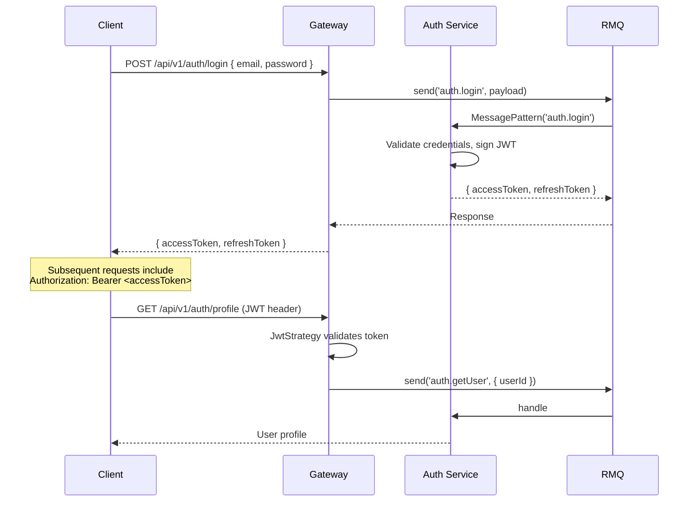

---

### 🔵 Auth Service

**Role:** User registration, authentication, and profile management.

| Property | Value |
|---|---|
| Port | 3001 |
| Queue | `auth_queue` |
| Global Prefix | `api/v1/` (note trailing slash) |
| HTTP Endpoints | Internal (health/management) |
| RMQ Patterns | `auth.login`, `auth.register`, `auth.refresh`, `auth.getUser`, `auth.getUserPreferences`, `auth.updateUserPreferences`, `auth.send-verification-code`, `auth.validate-verification-code`, `auth.send-password-reset-code`, `auth.validate-password-reset-code` |

**Capabilities:**

- User registration with email/password + bcrypt hashing
- JWT access + refresh token generation and validation
- Email verification code workflow
- Password reset flow
- Role-based access (Patient, Provider, Admin)
- User CRUD (admin only)
- Profile update and account deletion
- Cookie-parser for token storage on internal HTTP

---

### 🟣 Booking Service

**Role:** Appointment lifecycle, provider schedule management, slot availability.

| Property | Value |
|---|---|
| Port | 3002 |
| Queue | `booking_queue` |
| Global Prefix | `api/v1` |
| HTTP Controllers | `AvailabilityController`, `AppointmentController`, `ScheduleController` |

**Appointment States:**

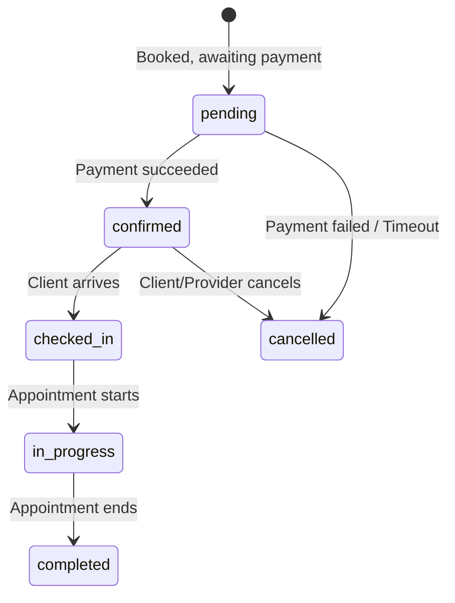

**Capabilities:**

- Provider schedule management (weekly recurring schedules with time windows)
- Automatic slot generation from schedules (configurable duration, buffer, advance booking)
- Time-slot hold mechanism with expiry
- Appointment CRUD with full state machine
- Provider notes on appointments
- Appointment change history tracking
- Cloud AMQP event emission on state changes

---

### 🟡 Provider Service

**Role:** Provider profiles, credentials, reviews, and search.

| Property | Value |
|---|---|
| Port | 3005 |
| Queue | `provider_queue` |
| Global Prefix | `api/v1` |
| HTTP Controllers | `ProfileController`, `ReviewController`, `AdminController` |

**Capabilities:**

- Provider profile CRUD with embedded credentials
- Credential verification workflow (admin)
- Review creation and listing (one review per appointment)
- Auto-computed `averageRating` and `totalReviews`
- Multi-parameter search (specialization, rating, city, language, verification)
- MongoDB text search on name/bio/specializations
- Paginated, sortable results

---

### 🔴 Payment Service

**Role:** Stripe payment processing and webhook handling.

| Property | Value |
|---|---|
| Port | 3004 |
| Queue | `payment_queue` |
| Global Prefix | `api/v1` |
| HTTP Endpoints | Stripe webhook only |

**Capabilities:**

- Stripe Checkout Session creation
- Stripe webhook verification (signature validation with raw body)
- `payment.succeeded` event emission to booking service
- Payment schema persistence in MongoDB
- RPC handler: `payment.create_checkout`

---

### 🟠 Notification Service

**Role:** Transactional email and SMS delivery.

| Property | Value |
|---|---|
| Port | 3003 |
| Queue | `notification_queue` |
| HTTP Endpoints | None (pure RMQ consumer) |
| RMQ Events | `user_created`, `appointment.booked`, `appointment.cancelled`, `appointment.rescheduled`, `appointment.reminder_24h`, `appointment.reminder_1h`, `appointment.completed`, `payment.succeeded`, `payout.requested` |

**Capabilities:**

- HTML email templates: welcome, booking confirmation, cancellation, 24h reminder, 1h reminder
- SMS notifications via Twilio for urgent events
- Event-driven: zero coupling to other services
- Scheduled reminders via `@nestjs/schedule` cron jobs (every 30 min)

---

## Shared Libraries

### `@app/common`

**Path:** `libs/common/src`

A shared library consumed by all services. Contents:

| Export | Description |
|---|---|
| `auth/guards/roles.guard.ts` | `RolesGuard` — checks user role against `@Roles()` decorator |
| `auth/decorators/roles.decorator.ts` | `@Roles(...)` decorator for endpoint role requirements |
| `auth/enums/roles.enum.ts` | `Role` enum: `PATIENT`, `PROVIDER`, `ADMIN` |
| `auth/strategies/jwt-strategy.service.ts` | `JwtStrategyService` — Passport JWT strategy with `access_secret` from env |
| `global/filters/global.filter.ts` | `CatchExceptionsFilter` — catches all exceptions in microservices |
| `global/filters/gateway.filter.ts` | `CatchGatewayExceptionsFilter` — catches exceptions in the API Gateway |
| `global/pipes/validateObjectId.pipe.ts` | `ValidateObjectIdPipe` — validates MongoDB ObjectId params |
| `global/dto/api-query.dto.ts` | `ApiQueryDto` — pagination DTO (`page`, `limit`, `select`, `sort`) |
| `global/types/paginated-res.interface.ts` | `PaginatedResult<T>` interface |
| `global/services/api-filter.service.ts` | `ApiFilterService` — pagination helper |
| `constants/rmq-patterns.ts` | All RMQ pattern constants organized by service |
| `constants/index.ts` | Re-export barrel |

### `@app/rmq`

**Path:** `libs/rmq/src`

A shared library for RabbitMQ connection management.

**`RmqService`**

```typescript
@Injectable()
export class RmqService {
  constructor(private readonly configService: ConfigService) {}

  // Creates RMQ connection options for a given queue
  getOptions(queue: string, noAck = false): RmqOptions;

  // Ack a message after successful processing
  ack(context: RmqContext): void;
}
```

**`RmqModule`**

A dynamic module used by the API Gateway to register `ClientProxy` instances:

```typescript
RmqModule.register({ name: 'BOOKING_SERVICE', queue: 'booking_queue' })
```

Each registration creates a `ClientProxy` bean that the gateway injects to send/emit RMQ messages.

---

## Messaging Architecture

### Pattern Types

| Type | Decorator | Usage | Gateway Method |
|---|---|---|---|
| **Request-Response (RPC)** | `@MessagePattern()` | Query data, mutate state, return result | `ClientProxy.send(pattern, data)` |
| **Fire-and-Forget (Event)** | `@EventPattern()` | Notify other services, log, send emails | `ClientProxy.emit(pattern, data)` |

### Queue Ownership

Each microservice exclusively owns its queue. The API Gateway connects to each queue as a producer only.

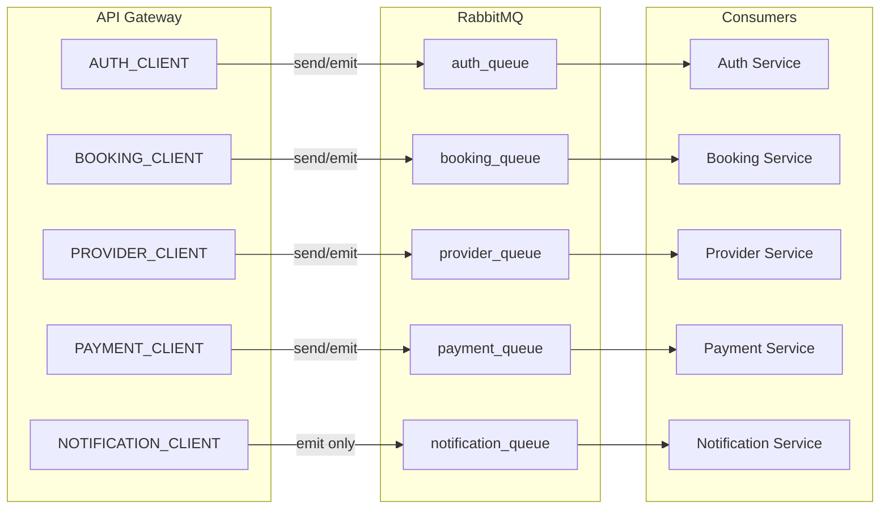

### Naming Conventions

| Pattern | Convention | Examples |
|---|---|---|
| RPC (MessagePattern) | `service.action` | `auth.login`, `booking.book`, `provider.getList` |
| Event (EventPattern) | `entity.action` | `user_created`, `appointment.booked`, `payment.succeeded` |

All pattern constants are defined in `libs/common/src/constants/rmq-patterns.ts`.

---

## Service Communication Matrix

### RPC (Request-Response) via `@MessagePattern`

| Producer | Consumer | Pattern | Purpose |
|---|---|---|---|
| API Gateway | Auth Service | `auth.login` | Authenticate user |
| API Gateway | Auth Service | `auth.register` | Register new user |
| API Gateway | Auth Service | `auth.refresh` | Refresh JWT |
| API Gateway | Auth Service | `auth.send-verification-code` | Send verification email |
| API Gateway | Auth Service | `auth.validate-verification-code` | Verify email code |
| API Gateway | Auth Service | `auth.send-password-reset-code` | Send password reset |
| API Gateway | Auth Service | `auth.validate-password-reset-code` | Reset password |
| API Gateway | Auth Service | `auth.getUser` | Get user by ID |
| API Gateway | Auth Service | `auth.getUserPreferences` | Get user notification prefs |
| API Gateway | Auth Service | `auth.updateUserPreferences` | Update notification prefs |
| API Gateway | Booking Service | `booking.book` | Book appointment |
| API Gateway | Booking Service | `booking.cancel` | Cancel appointment |
| API Gateway | Booking Service | `booking.reschedule` | Reschedule appointment |
| API Gateway | Booking Service | `booking.updateStatus` | Update appointment status |
| API Gateway | Booking Service | `booking.addProviderNotes` | Add provider notes |
| API Gateway | Booking Service | `booking.getAppointment` | Get appointment by ID |
| API Gateway | Booking Service | `booking.getMyAppointments` | List user's appointments |
| API Gateway | Booking Service | `booking.getAppointmentHistory` | Get change history |
| API Gateway | Booking Service | `booking.getAvailableSlots` | Query available slots |
| API Gateway | Booking Service | `booking.getAvailabilityRange` | Query availability range |
| API Gateway | Booking Service | `booking.holdSlot` | Hold a time slot |
| API Gateway | Booking Service | `booking.releaseSlot` | Release a held slot |
| API Gateway | Booking Service | `booking.createSchedule` | Create provider schedule |
| API Gateway | Booking Service | `booking.updateSchedule` | Update provider schedule |
| API Gateway | Booking Service | `booking.getMySchedule` | Get provider schedule |
| API Gateway | Booking Service | `booking.generateSlots` | Generate slot instances |
| API Gateway | Provider Service | `provider.getList` | List providers |
| API Gateway | Provider Service | `provider.getById` | Get provider by ID |
| API Gateway | Provider Service | `provider.createMe` | Create own profile |
| API Gateway | Provider Service | `provider.update` | Update profile |
| API Gateway | Provider Service | `provider.createReview` | Submit a review |
| API Gateway | Provider Service | `provider.getReviews` | Get provider reviews |
| API Gateway | Provider Service | `provider.search` | Search providers |
| API Gateway | Provider Service | `provider.verifyCredential` | Admin verify credential |
| API Gateway | Provider Service | `provider.listUnverifiedCredentials` | List unverified credentials |
| API Gateway | Payment Service | `payment.create_checkout` | Create Stripe checkout session |

### Events (Fire-and-Forget) via `@EventPattern`

| Producer | Consumer | Pattern | Purpose |
|---|---|---|---|
| Auth Service | Notification Service | `user_created` | Send welcome email |
| Booking Service | Notification Service | `appointment.booked` | Send booking confirmation |
| Booking Service | Notification Service | `appointment.cancelled` | Send cancellation notice |
| Booking Service | Notification Service | `appointment.rescheduled` | Send reschedule notice |
| Booking Service | Notification Service | `appointment.completed` | Send completion email |
| Payment Service | Booking Service | `payment.succeeded` | Confirm appointment |

---

## Endpoint Documentation

### API Gateway — External Endpoints (Port 3010)

All paths are prefixed with `/api/v1`.

#### Authentication

| Method | Path | Auth | Description |
|---|---|---|---|
| POST | `/auth/login` | No | Login with `{ email, password }`, returns JWT tokens |
| POST | `/auth/register` | No | Register new user |
| POST | `/auth/refresh` | No | Refresh access token with `{ refreshToken }` |
| GET | `/auth/profile` | JWT | Get current user profile |
| POST | `/auth/send-verification-code` | No | Send email verification code |
| POST | `/auth/validate-verification-code` | No | Validate email code |
| POST | `/auth/send-password-reset-code` | No | Send password reset code |
| POST | `/auth/validate-password-reset-code` | No | Validate reset code + set new password |

#### Appointments

| Method | Path | Auth | Description |
|---|---|---|---|
| POST | `/appointments` | JWT | Book appointment (`BookAppointmentDto`) |
| POST | `/appointments/cancel` | JWT | Cancel appointment (`CancelAppointmentDto`) |
| POST | `/appointments/reschedule` | JWT | Reschedule (`RescheduleAppointmentDto`) |
| PATCH | `/appointments/status` | JWT | Update status (`UpdateAppointmentStatusDto`) |
| PATCH | `/appointments/provider-notes` | JWT | Add provider notes (`ProviderNotesDto`) |
| GET | `/appointments/my` | JWT | Get my appointments (role-based) |
| GET | `/appointments/:id` | JWT | Get appointment by ID |
| GET | `/appointments/:id/history` | JWT | Get change history |

#### Availability

| Method | Path | Auth | Description |
|---|---|---|---|
| GET | `/availability/slots` | JWT | Get available slots (`?providerId&date`) |
| GET | `/availability/range` | JWT | Get availability range (`?providerId&fromDate&toDate`) |
| POST | `/availability/hold/:slotId` | JWT | Hold a slot temporarily |
| DELETE | `/availability/hold/:slotId` | JWT | Release a held slot |

#### Schedules

| Method | Path | Auth | Description |
|---|---|---|---|
| POST | `/schedules` | JWT | Create provider schedule |
| GET | `/schedules/my` | JWT | Get my provider schedule |
| GET | `/schedules/:providerId` | JWT | Get schedule by provider ID |
| PATCH | `/schedules/:providerId` | JWT | Update provider schedule |
| POST | `/schedules/generate-slots` | JWT | Generate slots for N days |

#### Providers

| Method | Path | Auth | Roles | Description |
|---|---|---|---|---|
| GET | `/providers` | JWT | Admin | List all providers |
| GET | `/providers/search` | JWT | — | Search providers |
| GET | `/providers/:id` | JWT | — | Get provider by ID |
| POST | `/providers/me` | JWT | Provider | Create own profile |
| PATCH | `/providers/:id` | JWT | Provider | Update profile |
| POST | `/providers/:id/reviews` | JWT | — | Create review |
| GET | `/providers/:id/reviews` | JWT | — | Get reviews |

#### Admin (Provider)

| Method | Path | Auth | Roles | Description |
|---|---|---|---|---|
| GET | `/admin/providers/credentials/unverified` | JWT | Admin | List unverified credentials |
| PATCH | `/admin/providers/:id/credentials/:credId/verify` | JWT | Admin | Verify credential |

---

## Environment Variables

| Variable | Description | Sensitive |
|---|---|---|
| `APP_NAME` | Application name identifier | |
| `APP_VERSION` | Application version | |
| `PLATFORM_NAME` | Platform code name | |
| `APP_ENV` | Environment (`development`, `production`) | |
| `AUTH_PORT` | Auth service HTTP port (3001) | |
| `BOOKING_PORT` | Booking service HTTP port (3002) | |
| `NOTIFICATION_PORT` | Notification service HTTP port (3003) | |
| `PAYMENT_PORT` | Payment service HTTP port (3004) | |
| `PROVIDER_PORT` | Provider service HTTP port (3005) | |
| `GATEWAY_PORT` | API Gateway HTTP port (3010) | |
| `Mongo_Uri` | MongoDB Atlas connection string | ✅ Yes |
| `RMQ_URL` | CloudAMQP connection URL | ✅ Yes |
| `access_secret` | JWT access token signing secret | ✅ Yes |
| `refresh_secret` | JWT refresh token signing secret | ✅ Yes |
| `host` | SMTP host (Gmail) | |
| `smtp_port` | SMTP port (465) | |
| `secure` | SMTP secure flag | |
| `user` | SMTP username (Gmail address) | ✅ Yes |
| `pass` | SMTP app password | ✅ Yes |
| `STRIPE_SECRET_KEY` | Stripe secret API key | ✅ Yes |
| `STRIPE_WEBHOOK_SECRET` | Stripe webhook signing secret | ✅ Yes |

> **Warning:** The `.env` file contains live secrets for MongoDB Atlas, CloudAMQP, Stripe, Twilio, and Gmail. Never commit this file. It is already in `.gitignore`.

---

## Running the Project

### Prerequisites

- **Node.js** >= 22
- **npm** >= 10
- A running **RabbitMQ** instance (or CloudAMQP account — URL configured in `.env`)
- A **MongoDB** instance (or Atlas cluster — URI configured in `.env`)

### Installation

```bash
npm install
```

### Development (Single Service)

```bash
# Start auth_service (default)
npm run start:dev

# Start a specific service in watch mode
npm run start:auth
npm run start:booking
npm run start:notification
npm run start:payment
npm run start:provider
npm run start:api-gateway
```

### Development (All Services)

```bash
npm run start:dev:all
```

This runs all 6 services concurrently via the `concurrently` package. Each service binds to its configured port.

### Build

```bash
npm run build
```

Uses `nest build` with **webpack** enabled (configured in `nest-cli.json`). Output goes to `dist/`.

### Production

```bash
npm run start:prod
```

Runs `node dist/apps/auth_service/main` — you would typically run each service separately in production.

### Testing

```bash
# Run all unit tests (*.spec.ts under apps/)
npm run test

# With coverage
npm run test:cov

# Watch mode
npm run test:watch

# Debug mode
npm run test:debug

# E2E tests
npm run test:e2e
```

> **Note:** Tests are co-located with source files (`*.spec.ts`). Jest is configured with `roots: ["<rootDir>/apps/"]`.

### Linting & Formatting

```bash
# Lint and auto-fix
npm run lint

# Format with Prettier
npm run format

# Prettier config: singleQuote, trailingComma: "all"
```

---

## Docker (Future)

While Docker infrastructure is not yet implemented, the following architecture is planned:

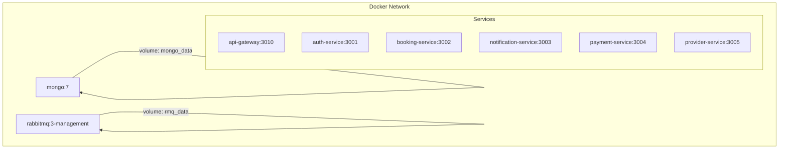

**Planned:**

- Multi-stage Dockerfiles per service (`node:20-alpine`)
- `docker-compose.yml` for development with MongoDB + RabbitMQ + all 6 services
- `docker-compose.prod.yml` with health checks, resource limits, restart policies
- Traefik or Nginx reverse proxy with SSL termination

---

## Security

### Authentication

- **JWT-based** with `access_secret` and `refresh_secret` from environment variables
- Passport `jwt-strategy` validates the `Authorization: Bearer <token>` header on every guarded endpoint
- Token refresh flow with dedicated endpoint
- bcrypt password hashing for credential storage

### Authorization (RBAC)

Three roles: `PATIENT`, `PROVIDER`, `ADMIN`. Enforced by `RolesGuard` + `@Roles()` decorator:

```typescript
@Roles([Role.ADMIN])
@Get('/admin/providers/credentials/unverified')
async listUnverifiedCredentials() { ... }
```

### Input Validation

- **Global `ValidationPipe`** with `{ whitelist: true, transform: true }` on most services
- DTOs decorated with `class-validator` (`@IsString()`, `@IsMongoId()`, `@Min()`, `@Max()`, etc.)
- `ValidateObjectIdPipe` for route params that must be valid MongoDB ObjectIds
- Stripe webhook: signature verified via `stripe-signature` header

### Rate Limiting

- **4 requests per minute** per client on the API Gateway (via `@nestjs/throttler`)
- Configurable `ttl` and `limit` in `api-gateway.module.ts`

### Exception Handling

- `CatchGatewayExceptionsFilter` — global filter on the API Gateway for consistent HTTP error responses
- `CatchExceptionsFilter` — global filter on microservices for RMQ error handling

### Additional Measures

- Environment variables with live secrets are **gitignored**
- `cookie-parser` enabled in auth service (but not exposed to external traffic)

---

## Performance

### Async Processing

- All inter-service communication is asynchronous via RabbitMQ
- Long-running operations (email, SMS) never block the request-response cycle
- Payment webhook processing is decoupled from booking confirmation via events

### Loose Coupling

- Services communicate exclusively through RMQ message patterns
- No direct HTTP calls between microservices
- Any service can be independently scaled horizontally

### Scalability

- Stateless services (no in-memory session state) — scale by adding instances
- RabbitMQ handles message distribution across consumers
- MongoDB indexes support query performance on appointments, provider profiles

### Caching Opportunities (Future)

- Provider search results (Redis)
- Availability slots (refresh on schedule update)
- Provider profile data (cache aside)

---

## Future Roadmap

| Phase | Feature | Priority | Status |
|---|---|---|---|
| Phase 0 | Foundation + Notification Service | High | ✅ Complete |
| Phase 1 | Provider Service | High | ✅ Complete |
| Phase 2 | **AI Agents Service** — smart scheduling, no-show prediction, chatbot, document classification, provider matching | Medium | 📋 Planned |
| Phase 3 | **Document Service** — upload, versioning, OCR, e-signatures, templates, access control | Medium | 📋 Planned |
| Phase 4 | **Analytics Service** — revenue analytics, appointment metrics, provider performance, dashboard, report export | Medium | 📋 Planned |
| Phase 5 | **DevOps** — Docker, Kubernetes, CI/CD, monitoring, logging, secrets management | High | 📋 Planned |

### Planned Service Architecture (Final State)

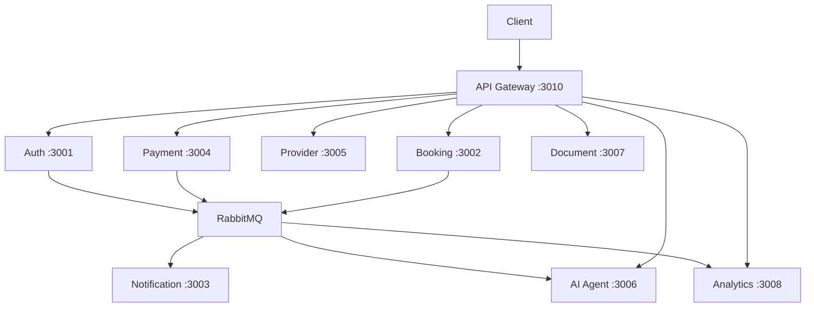

### Detailed Future Features

<details>
<summary><strong>AI Agents Service</strong> (Phase 2)</summary>

- Smart scheduling suggestions based on provider patterns
- No-show risk prediction (rule-based scoring)
- Chatbot with intent routing (book, cancel, reschedule, FAQ)
- Document auto-classification (contract, court filing, affidavit, motion)
- Provider-patient matching with weighted scoring
</details>

<details>
<summary><strong>Document Service</strong> (Phase 3)</summary>

- File upload (Multer) with local/S3 storage
- Document CRUD with versioning
- Access control and sharing
- Document templates with variable rendering
- OCR via Tesseract.js
- Digital signatures (e-signature)
</details>

<details>
<summary><strong>Analytics Service</strong> (Phase 4)</summary>

- Revenue snapshots with period comparison
- Appointment metrics (no-show rate, cancellation rate, completion rate)
- Provider performance leaderboard
- Dashboard endpoint with cached snapshots
- PDF/CSV report export
</details>

<details>
<summary><strong>DevOps & Infrastructure</strong> (Phase 5)</summary>

- Multi-stage Dockerfiles per service
- Docker Compose (dev + prod)
- GitHub Actions CI/CD (lint → test → build → deploy)
- Health endpoints on every service
- Prometheus + Grafana monitoring
- Centralized logging (ELK / Grafana Loki)
- Traefik/Nginx reverse proxy with SSL
- Docker Swarm or Kubernetes orchestration
</details>

---

## Development Guidelines

### Naming Conventions

| Element | Convention | Example |
|---|---|---|
| RMQ Pattern (RPC) | `service.action` | `booking.getAppointments` |
| RMQ Pattern (Event) | `entity.action` | `appointment.booked` |
| RMQ Queues | `service_queue` | `booking_queue` |
| DTO Classes | PascalCase + `Dto` suffix | `BookAppointmentDto` |
| Controller Classes | PascalCase + `Controller` suffix | `BookingController` |
| Service Classes | PascalCase + `Service` suffix | `BookingService` |
| Files | `kebab-case` | `booking_service.controller.ts` |

### Folder Structure per App

```
service_name/
├── src/
│   ├── main.ts
│   ├── service_name.module.ts
│   ├── service_name.controller.ts   # HTTP controllers
│   ├── service_name.service.ts       # Business logic
│   ├── dtos/                         # Request/response DTOs
│   ├── models/                       # Mongoose schemas
│   ├── rpc/ or rpcController/        # RMQ message/event handlers
│   └── services/                     # Sub-services
```

### Code Style

- **Prettier:** `singleQuote: true`, `trailingComma: "all"`
- **ESLint:** TypeScript recommended, `@typescript-eslint/no-explicit-any: off`, `@typescript-eslint/no-floating-promises: warn`
- Automatic formatting: `npm run lint` runs eslint + prettier `--fix`
- No semicolons allowed from ESLint (handled by Prettier)

### Testing Guidelines

- Tests are co-located with source files as `*.spec.ts`
- Jest root is `apps/`
- Follow the existing pattern in `booking_service.controller.spec.ts` and `payment_service.controller.spec.ts`

### Adding a New Microservice

1. `nest generate app <name>`
2. Add queue name to `QUEUES` in `libs/common/src/constants/rmq-patterns.ts`
3. Add `RmqModule.register({ name, queue })` to API Gateway
4. Add `start:<name>` script in `package.json`
5. Wire into `start:dev:all` script

---

## Architecture Decisions

### Why Microservices?

This system manages **six distinct business domains** (auth, booking, providers, payments, notifications, and future AI/document/analytics). A monolithic architecture would couple these domains, making independent deployment, scaling, and team ownership impossible. Microservices give us:

- **Independent deployability** — update booking logic without touching auth
- **Fault isolation** — a bug in notification email templates never blocks a payment
- **Technology flexibility** — each service could use its own database or runtime version
- **Scaling granularity** — scale the booking service independently during peak hours

### Why RabbitMQ?

- **Native NestJS support** — `@nestjs/microservices` provides first-class RMQ transport with `@MessagePattern` and `@EventPattern` decorators
- **Durable messaging** — messages survive broker restarts with `queueOptions: { durable: true }`
- **RPC + Events** — single broker handles both request-response and pub/sub patterns
- **CloudAMQP** — managed RabbitMQ with zero operational overhead

### Why NestJS?

- **Monorepo-native** — `nest-cli.json` manages multiple apps and libs with shared config
- **Decorator-based architecture** — clean separation of controllers, services, modules, and DTOs
- **Microservice transport abstraction** — swap RMQ for Kafka or NATS by changing a single line
- **Swagger integration** — `@nestjs/swagger` generates OpenAPI docs automatically

### Why MongoDB?

- **Document model** — appointments, schedules, and provider profiles have nested sub-documents (time windows, credentials, reviews) that map naturally to MongoDB documents
- **Schema flexibility** — provider profiles can evolve without migrations
- **Mature NestJS integration** — `@nestjs/mongoose` with decorator-based schemas
- **Text search** — MongoDB text indexes power provider search

### Why Shared Libraries?

- **`@app/common`** — guards, filters, pipes, and DTOs are identical across all services. Duplication would create security gaps and maintenance burden
- **`@app/rmq`** — every service needs the same RMQ connection setup. A shared lib prevents subtle config drift in queue options, heartbeat settings, and reconnection logic

### Why API Gateway?

- **Single entry point** — one origin for clients simplifies CORS, rate limiting, and authentication
- **Protocol translation** — HTTP ↔ RMQ translation happens in one place
- **Request aggregation** — a single client request can fan out to multiple services without the client knowing

### Why RPC + Events?

- **RPC (`@MessagePattern`)** — used when the client needs a response (login, get profile, book appointment). The gateway awaits the result and sends an HTTP response
- **Events (`@EventPattern`)** — used for side effects that shouldn't block the client (send email, trigger notification, update analytics). The producer emits and continues immediately

---

## Best Practices

### Logging

- Use NestJS built-in `Logger` or injectable `LoggerService`
- Log entry and exit of RMQ handlers for traceability
- Never log secrets, tokens, or payment details

### Error Handling

- All services use global exception filters (`CatchExceptionsFilter` for microservices, `CatchGatewayExceptionsFilter` for gateway)
- Return structured error objects from RMQ handlers — never throw raw exceptions into the queue
- Stripe webhook responds `200` to acknowledge receipt; async processing handles business logic

### Retry Strategies

- RabbitMQ provides automatic reconnection (`reconnectTimeInSeconds: 5`) via `amqp-connection-manager`
- For transient failures, consider dead letter queues (future)

### Health Checks

- Every service exposes an HTTP server (even notification service) for health/liveness probes
- Planned `/health` endpoint per service with uptime and DB connection status

### Dead Letter Queues (Future)

- Configure per-queue DLX for messages that fail processing after retries
- DLQ consumer alerts operations team

### API Documentation

- Swagger UI at `GET /api` on the API Gateway
- Document all DTOs with `class-validator` decorators for automatic schema generation
- Use `@ApiTags()`, `@ApiBearerAuth()`, `@ApiOperation()` decorators for richer docs

### Environment Management

- `.env` in root for development (gitignored)
- Production secrets: GitHub Secrets → injected as environment variables in CI/CD → Docker secrets
- Validate required env vars at bootstrap via `ConfigService.getOrThrow()`

### Versioning

- All HTTP routes under `/api/v1` prefix
- RMQ patterns versioned by convention (avoid breaking changes by adding new patterns rather than modifying existing ones)

### Deployment Checklist

1. Run `npm run lint` — fix all warnings
2. Run `npm run test` — ensure all tests pass
3. Run `npm run build` — verify clean build
4. Update `.env` with production values
5. Deploy each service independently

---

<p align="center">
  <strong>Built with NestJS, RabbitMQ, and MongoDB</strong><br />
  <em>A production-grade microservice platform for modern legal practice management.</em>
</p>
