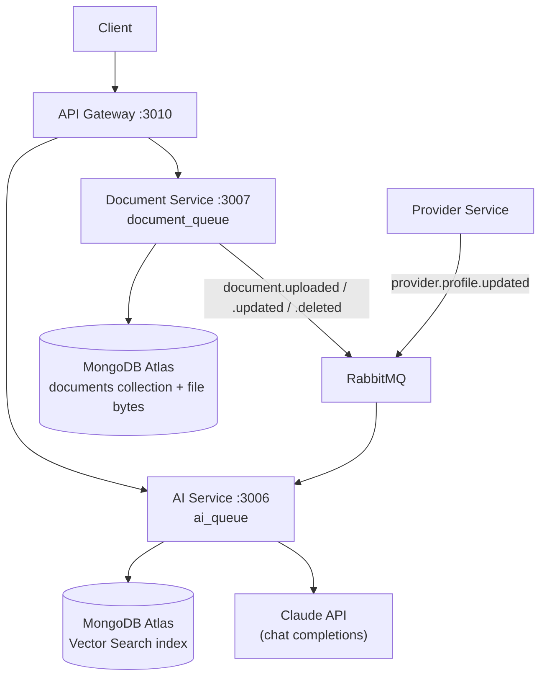
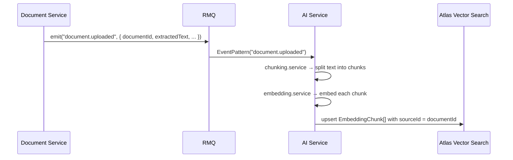
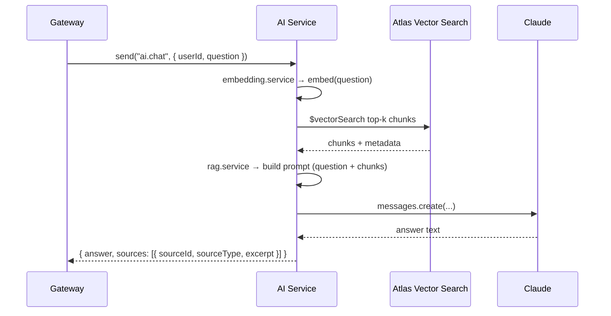
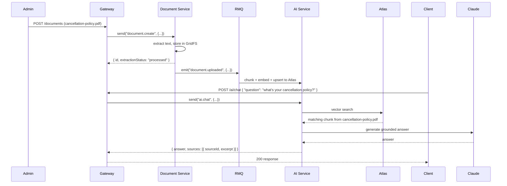

# Document Service + AI Service — Implementation Plan

<p align="center">
  <strong>Phase A:</strong> Document Service (simple, storage + metadata only) &nbsp;→&nbsp;
  <strong>Phase B:</strong> AI Service (RAG on top of documents + existing domain data)
</p>

---

## Table of Contents

- [1. Why Document Service First](#1-why-document-service-first)
- [2. What the AI Actually Gets From It](#2-what-the-ai-actually-gets-from-it)
- [3. High-Level Architecture](#3-high-level-architecture)
- [4. Phase A — Document Service](#4-phase-a--document-service)
  - [4.1 Responsibilities](#41-responsibilities)
  - [4.2 Data Model](#42-data-model)
  - [4.3 File Structure](#43-file-structure)
  - [4.4 Endpoints (HTTP, via Gateway)](#44-endpoints-http-via-gateway)
  - [4.5 RPC Contracts (internal, RMQ)](#45-rpc-contracts-internal-rmq)
  - [4.6 Events Emitted](#46-events-emitted)
  - [4.7 Build Order](#47-build-order)
- [5. Phase B — AI Service](#5-phase-b--ai-service)
  - [5.1 Responsibilities](#51-responsibilities)
  - [5.2 Data Model](#52-data-model)
  - [5.3 File Structure](#53-file-structure)
  - [5.4 Ingestion Pipeline](#54-ingestion-pipeline)
  - [5.5 Query Pipeline (RAG)](#55-query-pipeline-rag)
  - [5.6 Endpoints (HTTP, via Gateway)](#56-endpoints-http-via-gateway)
  - [5.7 RPC Contracts (internal, RMQ)](#57-rpc-contracts-internal-rmq)
  - [5.8 Build Order](#58-build-order)
- [6. End-to-End Sequence Diagrams](#6-end-to-end-sequence-diagrams)
- [7. New Environment Variables](#7-new-environment-variables)
- [8. Milestone Checklist](#8-milestone-checklist)

---

## 1. Why Document Service First

Right now nothing in the system holds unstructured text — profiles and appointments are structured Mongo documents, which is not what a RAG pipeline is built to search. Before the AI service can answer anything useful, it needs a body of text to retrieve from. The Document Service is the **cheapest possible source of that text**:

- It's a plain CRUD + file-storage service — no AI, no vectors, no LLM calls. Easy to build, easy to test in isolation.
- The moment it exists, it emits events (`document.uploaded`, `document.updated`, `document.deleted`) that the AI service can consume to build its index — this is the same event-driven pattern you already use for notifications.
- It gives you a real, growing corpus (contracts, intake forms, firm policies, FAQs) instead of a toy dataset, so the RAG pipeline gets built and tested against realistic content from day one.

**MVP scope for Phase A is intentionally narrow:** upload a file, store it, keep metadata, extract plain text, emit an event. No versioning, no e-signatures, no OCR yet — those are backlog items from your existing roadmap (Phase 3 in your README). We're only building the slice the AI service needs.

---

## 2. What the AI Actually Gets From It

| Document type (MVP) | What retrieval-augmented generation lets the AI do |
|---|---|
| Firm FAQ / policy docs | Answer client questions ("what's your cancellation policy?") grounded in the firm's actual wording, not a hallucinated guess |
| Provider bios / credentials (already in Provider Service, indexed alongside) | Chatbot can answer "which providers handle immigration cases in Cairo?" with cited sources |
| Uploaded case documents / intake forms | Later: summarize a case file, answer "what did the client say about the incident date?" |
| Appointment history (already in Booking Service) | Later: "why was this appointment rescheduled twice?" answered from actual change history |

The core benefit: **grounding + citations**. Without RAG, an LLM call is just Claude guessing from general training data. With RAG, every answer is backed by a specific chunk of a specific document, which you can show the user ("source: cancellation-policy.pdf, updated June 2026") and audit later — important in a legal context where made-up answers are a real liability.

---

## 3. High-Level Architecture



Both new services follow your existing pattern exactly: an HTTP controller layer only exists behind the gateway conceptually (the gateway is the only public HTTP surface), and each service exposes `@MessagePattern` / `@EventPattern` handlers over its own queue.

---

## 4. Phase A — Document Service

### 4.1 Responsibilities

- Accept file uploads (PDF, DOCX, TXT to start — matches your existing docx/pdf usage elsewhere)
- Store the raw file (GridFS in the same Mongo Atlas cluster — no new infra, consistent with your "why MongoDB" rationale elsewhere in the repo)
- Store metadata (owner, type, tags, linked entity e.g. `appointmentId` or `providerId`)
- Extract plain text on upload (simple parser: `pdf-parse` for PDF, `mammoth` for DOCX, raw read for TXT)
- Emit an event whenever a document is created, updated, or deleted, so the AI service can (re)index it
- Basic access control: owner + admin only, reusing your existing `RolesGuard` / `@Roles()` pattern

Explicitly **out of scope for the MVP**: OCR, e-signatures, versioning, templates. Those stay in your Phase 3 roadmap as-is.

### 4.2 Data Model

```typescript
// document_service/src/models/document.schema.ts
@Schema({ timestamps: true })
export class Document {
  @Prop({ required: true }) ownerId: string;          // uploader's userId
  @Prop({ required: true }) ownerRole: Role;           // PATIENT | PROVIDER | ADMIN
  @Prop({ required: true }) fileName: string;
  @Prop({ required: true }) mimeType: string;
  @Prop({ required: true }) sizeBytes: number;
  @Prop({ required: true }) gridFsId: string;          // pointer to GridFS bucket
  @Prop() extractedText: string;                       // plain text, used later for chunking
  @Prop({ enum: ['policy', 'faq', 'case_file', 'intake_form', 'other'], default: 'other' })
  category: string;
  @Prop({ type: [String], default: [] }) tags: string[];
  @Prop() linkedProviderId?: string;
  @Prop() linkedAppointmentId?: string;
  @Prop({ enum: ['pending', 'processed', 'failed'], default: 'pending' })
  extractionStatus: string;
}
```

### 4.3 File Structure

```
apps/document_service/
└── src/
    ├── main.ts
    ├── document_service.module.ts
    ├── document_service.controller.ts     # HTTP: health only, everything else via RMQ
    ├── models/
    │   └── document.schema.ts
    ├── dtos/
    │   ├── upload-document.dto.ts
    │   ├── update-document.dto.ts
    │   └── search-document.dto.ts
    ├── services/
    │   ├── document.service.ts             # CRUD orchestration
    │   ├── storage.service.ts              # GridFS read/write
    │   └── text-extraction.service.ts      # pdf-parse / mammoth / raw text
    └── rpcController/
        ├── document.rpc.controller.ts      # @MessagePattern handlers
        └── document.events.ts              # @EventPattern emitters (helper)
```

### 4.4 Endpoints (HTTP, via Gateway)

All under `/api/v1/documents`, JWT-protected.

| Method | Path | Input | Output |
|---|---|---|---|
| `POST` | `/documents` | `multipart/form-data`: `file`, `category`, `tags[]`, `linkedProviderId?`, `linkedAppointmentId?` | `201 { id, fileName, category, extractionStatus: "pending" }` |
| `GET` | `/documents/:id` | — | `200 { id, fileName, mimeType, sizeBytes, category, tags, extractedText, createdAt }` |
| `GET` | `/documents` | query: `?category=&tag=&ownerId=&page=&limit=` | `200 { data: Document[], page, limit, total }` |
| `PATCH` | `/documents/:id` | `{ category?, tags? }` | `200 { id, category, tags }` |
| `DELETE` | `/documents/:id` | — | `204` |
| `GET` | `/documents/:id/download` | — | binary stream, `Content-Disposition: attachment` |

### 4.5 RPC Contracts (internal, RMQ)

| Pattern | Input | Output |
|---|---|---|
| `document.create` | `{ ownerId, ownerRole, fileBuffer, fileName, mimeType, category, tags, linkedProviderId?, linkedAppointmentId? }` | `{ id, extractionStatus }` |
| `document.get` | `{ id }` | `{ id, fileName, extractedText, category, tags, ... }` |
| `document.list` | `{ ownerId?, category?, tag?, page, limit }` | `{ data: Document[], total }` |
| `document.update` | `{ id, category?, tags? }` | `{ id, category, tags }` |
| `document.delete` | `{ id }` | `{ deleted: true }` |

### 4.6 Events Emitted

| Event | Payload | Purpose |
|---|---|---|
| `document.uploaded` | `{ documentId, extractedText, category, tags, linkedProviderId?, linkedAppointmentId? }` | AI service ingests → chunks → embeds |
| `document.updated` | `{ documentId, extractedText, category, tags }` | AI service re-embeds the changed chunks |
| `document.deleted` | `{ documentId }` | AI service removes associated vectors |

### 4.7 Build Order

1. Scaffold `nest generate app document_service`, add `document_queue` to `libs/common/src/constants/rmq-patterns.ts`
2. Add `Document` Mongoose schema + GridFS bucket connection
3. Build `text-extraction.service.ts` — start with TXT + PDF (`pdf-parse`) only, add DOCX (`mammoth`) next
4. Build `document.rpc.controller.ts` with the 5 RPC patterns above
5. Wire event emission (`document.uploaded` etc.) after each successful write
6. Add `DocumentController` + `RmqModule.register(...)` to the API Gateway, matching your existing gateway pattern
7. Write `*.spec.ts` tests for the RPC handlers, following your existing `booking_service.controller.spec.ts` pattern

---

## 5. Phase B — AI Service

### 5.1 Responsibilities

- Maintain a vector index of chunked text from documents + provider profiles
- Answer natural-language questions with retrieval-augmented generation (grounded, cited)
- Own the only dependency on the Claude API and the embedding provider
- Later (not MVP): no-show prediction, provider matching, document classification

### 5.2 Data Model

```typescript
// ai_service/src/models/embedding.schema.ts
@Schema({ timestamps: true })
export class EmbeddingChunk {
  @Prop({ required: true }) sourceType: 'document' | 'provider_profile';
  @Prop({ required: true }) sourceId: string;         // documentId or providerId
  @Prop({ required: true }) chunkIndex: number;
  @Prop({ required: true }) text: string;             // the chunk itself, ~300-500 tokens
  @Prop({ type: [Number], required: true }) embedding: number[]; // vector, indexed via Atlas Vector Search
  @Prop({ type: Object }) metadata: Record<string, any>; // category, tags, providerId, etc — used as a pre-filter
}

// ai_service/src/models/conversation.schema.ts (optional, for multi-turn chat)
@Schema({ timestamps: true })
export class Conversation {
  @Prop({ required: true }) userId: string;
  @Prop({ type: [{ role: String, content: String }], default: [] }) messages: { role: string; content: string }[];
}
```

### 5.3 File Structure

```
apps/ai_service/
└── src/
    ├── main.ts
    ├── ai_service.module.ts
    ├── ai_service.controller.ts            # HTTP: health only
    ├── models/
    │   ├── embedding.schema.ts
    │   └── conversation.schema.ts
    ├── dtos/
    │   ├── chat-query.dto.ts
    │   └── chat-response.dto.ts
    ├── services/
    │   ├── embedding.service.ts            # calls Voyage/OpenAI embeddings API
    │   ├── chunking.service.ts             # splits extractedText into ~400-token chunks
    │   ├── vector-store.service.ts         # $vectorSearch queries + upsert/delete
    │   ├── llm.service.ts                  # Claude API wrapper (system prompt, tool use)
    │   └── rag.service.ts                  # orchestrates: embed → search → prompt → generate
    ├── rpcController/
    │   ├── ai.rpc.controller.ts            # @MessagePattern: ai.chat
    │   └── ai.events.controller.ts         # @EventPattern: document.*, provider.*
    └── config/
        └── ai.config.ts                    # model names, chunk size, top-k, timeouts
```

### 5.4 Ingestion Pipeline

Pure event consumer — no HTTP, same shape as your Notification Service.



Same pattern for `provider.profile.updated` (source: Provider Service) — re-chunk and re-embed that provider's bio/specializations whenever it changes.

### 5.5 Query Pipeline (RAG)



### 5.6 Endpoints (HTTP, via Gateway)

All under `/api/v1/ai`, JWT-protected, **separate rate limiter** (LLM calls are slow/expensive — don't share your 4 req/min global throttle config here without reviewing it).

| Method | Path | Input | Output |
|---|---|---|---|
| `POST` | `/ai/chat` | `{ question: string, conversationId?: string }` | `200 { answer: string, sources: [{ sourceId, sourceType, excerpt }], conversationId }` |
| `GET` | `/ai/conversations/:id` | — | `200 { id, messages: [{ role, content }] }` |

### 5.7 RPC Contracts (internal, RMQ)

| Pattern | Input | Output |
|---|---|---|
| `ai.chat` | `{ userId, question, conversationId? }` | `{ answer, sources, conversationId }` |
| `ai.reindex` (admin/manual trigger) | `{ sourceType, sourceId }` | `{ reindexed: true, chunkCount }` |

### 5.8 Build Order

1. Scaffold `nest generate app ai_service`, add `ai_queue` to shared constants, register `AI_SERVICE` client in the gateway
2. Enable **MongoDB Atlas Vector Search** on your existing cluster; create the `embeddingchunks` collection + vector index (no new infrastructure)
3. Build `chunking.service.ts` (simple fixed-size splitter with overlap — don't over-engineer this first pass)
4. Build `embedding.service.ts` wrapping your chosen embeddings API
5. Build `ai.events.controller.ts` consuming `document.uploaded` / `document.updated` / `document.deleted` — get ingestion working and verified (query Mongo directly to confirm vectors land) before touching generation
6. Build `vector-store.service.ts` (`$vectorSearch` aggregation query)
7. Build `llm.service.ts` (Claude API call, system prompt template that instructs the model to answer only from provided context and say when it doesn't know)
8. Build `rag.service.ts` tying it together, expose via `ai.rpc.controller.ts`
9. Add `AiController` + DTO validation to the gateway, with its own throttler config and a longer RMQ timeout
10. Add logging: tokens used, latency, retrieved chunk count, per request — before adding any more AI features on top

---

## 6. End-to-End Sequence Diagrams

**Full flow, upload to answer:**



---

## 7. New Environment Variables

| Variable | Used by | Description |
|---|---|---|
| `DOCUMENT_PORT` | Document Service | HTTP port (suggest 3007) |
| `AI_PORT` | AI Service | HTTP port (suggest 3006) |
| `ANTHROPIC_API_KEY` | AI Service | Claude API key |
| `EMBEDDING_API_KEY` | AI Service | Voyage/OpenAI embeddings key |
| `EMBEDDING_MODEL` | AI Service | e.g. `voyage-3` or `text-embedding-3-small` |
| `AI_CHAT_MODEL` | AI Service | e.g. `claude-sonnet-4-6` |
| `RAG_TOP_K` | AI Service | number of chunks retrieved per query (start with 5) |
| `RAG_CHUNK_SIZE` | AI Service | tokens per chunk (start with ~400) |
| `GRIDFS_BUCKET` | Document Service | GridFS bucket name |

---

## 8. Milestone Checklist

**Phase A — Document Service**

- [ ] Scaffold app, queue, gateway registration
- [ ] `Document` schema + GridFS storage
- [ ] Text extraction (TXT → PDF → DOCX)
- [ ] RPC handlers (`document.create/get/list/update/delete`)
- [ ] Events emitted on create/update/delete
- [ ] Gateway `DocumentController` + Swagger docs
- [ ] Tests (`*.spec.ts`)

**Phase B — AI Service**

- [ ] Atlas Vector Search index created
- [ ] Chunking + embedding services
- [ ] Ingestion consumer wired to `document.*` and `provider.*` events
- [ ] Verify vectors land correctly (manual query before building generation)
- [ ] `vector-store.service.ts` search query
- [ ] `llm.service.ts` Claude wrapper with grounded system prompt
- [ ] `rag.service.ts` orchestration + `ai.chat` RPC
- [ ] Gateway `AiController`, dedicated rate limit, longer RMQ timeout
- [ ] Logging: tokens, latency, retrieved chunk count
- [ ] Tests (`*.spec.ts`)
